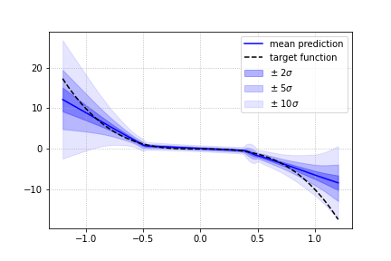

# Tensorflow - Bayes by Backprop

## Description

This repository contains a basic implementation of the "Weight uncertainty in neural networks" paper for approximate variational inference by Blundell et al. using TensorFlow. In order to show the possibilities of the network, the code is accompanied by a python notebook with a simple regression problem.

## Prerequisites

### Minimal Requirements: 

 - Tensorflow 2.x
 - TensorflowProbability
 - overrides

### Additional Requirements:

> Note: The following python packages are only required for running the accompanying code example in _example.ipynb 

 - numpy
 - matplotlib 

## References

[1] Charles Blundell, Julien Cornebise, Koray Kavukcuoglu, and Daan Wierstra. 2015. Weight uncertainty in neural networks. In <i>Proceedings of the 32nd International Conference on International Conference on Machine Learning - Volume 37</i> (<i>ICML'15</i>). JMLR.org, 1613–1622.

